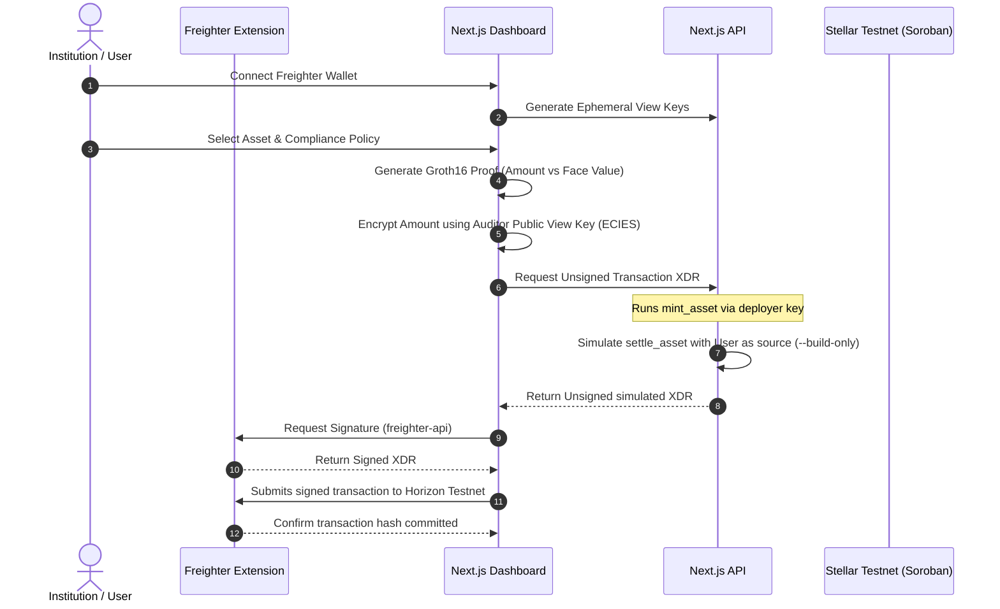

# Lantern: Private RWA Registry & ZK Settlement on Stellar

Lantern implements a load-bearing, production-grade **Zero-Knowledge Proof (ZKP)** private settlement and **selective disclosure** mechanism for tokenized Real-World Assets (RWAs) on the Stellar Testnet. 

By leveraging native **BLS12-381** elliptic curve support in Soroban (Protocol 27+), Lantern verifies that private transaction values satisfy asset face-value policies without leaking private balances to the public ledger.

---

## 🏗️ Architecture Overview

The settlement pipeline integrates zero-knowledge cryptography, hybrid ECDH + AES-256-GCM encryption (ECIES), and decentralized client-side signing:



---

## 🔑 Key Capabilities

1.  **On-Chain RWA Issuance Portal:**
    *   Dynamic asset minting on the Stellar ledger via the contract's `mint_asset` function.
    *   Uses a **hybrid execution flow**: falls back to WSL CLI locally using deployer keys, or uses a `DEPLOYER_SECRET` environment variable for direct, native Soroban transaction building and signing when deployed in cloud environments.
2.  **Secondary Market Discount Yield Slider:**
    *   Mitigates metadata leakage attacks by decoupling public par values from private settlement amounts.
    *   Toggles between **Par Value** and **Secondary Discount** with a live range slider (0% to 15%) that recalculates the settlement values and proofs in real-time.
3.  **Zero-Knowledge Compliance Engine (`Circom + Groth16`):**
    *   Proves that the private transaction value matches the locked RWA face value.
    *   Verifies set-membership and inequality compliance constraints on-chain using native Soroban pairing operations.
4.  **ECIES On-Chain Event Storage:**
    *   Uses a hybrid **ECDH (secp256r1) + AES-256-GCM** scheme to encrypt private ledger metadata using the auditor's Public View Key.
    *   Emits the ciphertext directly on-chain as a Soroban ledger event, binding the audit trail permanently to the transaction.
5.  **On-Chain Maturity & Redemption Flow:**
    *   Allows investors to cash out settled assets at maturity.
    *   Constructs a native Stellar payment transaction for the face value from the investor to the issuer (signed via Freighter and submitted to Horizon), confirming RWA retirement on-ledger.
6.  **Live On-Chain Status Synchronization:**
    *   On page load, the frontend executes a batch query to the Soroban RPC contract to fetch the real, live state of all assets.
    *   Assets already settled on-chain are marked as `Settled` instantly and display their respective redemption triggers.
7.  **Descriptive Compliance Error Parser:**
    *   Intercepts contract execution failures and parses error codes directly (e.g. mapping code `#102` to a user-friendly *"Asset already settled on-chain"* warning).

---

## 📂 Project Structure

```text
├── circuits/                       # ZK Proof Infrastructure
│   ├── settlement.circom           # Proving logic (Amount verification & commitment check)
│   ├── poseidon255.circom          # Hash function constraint definition
│   ├── custom_vk_args.json         # Groth16 verification key parameters formatted for Soroban
│   └── custom_proof_args.json      # Groth16 proof parameter vectors formatted for Soroban
│
├── contracts/
│   └── rwa_settlement/             # Soroban Smart Contract source code
│       ├── src/lib.rs              # Contract logic (mint_asset, settle_asset, verification)
│       └── Cargo.toml
│
├── frontend/                       # Next.js App Router Frontend
│   ├── src/app/
│   │   ├── page.tsx                # Geniestudio Landing Page
│   │   ├── app/page.tsx            # Compliance console and settlement dashboard
│   │   ├── api/assets/sync/        # Batch on-chain status sync endpoint
│   │   ├── api/mint/               # On-chain asset minting endpoint (native & CLI hybrid)
│   │   ├── api/redeem/prepare/     # On-chain redemption transaction constructor
│   │   └── api/settle/route.ts     # Two-phase transaction simulation & Horizon submitter
│   └── package.json
│
├── src/utils/                      # Cryptographic utilities and scripts
│   ├── cryptoDisclosure.ts         # ECDH secp256r1 + AES-256-GCM browser/node implementation
│   ├── run_onchain_settlement.js   # Automated integration test runner
│   └── test_disclosure.js          # Disclosure encryption/decryption unit test
```

---

## 🌐 On-Chain Deployment Details (Stellar Testnet)

*   **Groth16 Verifier Contract ID:** `CCRUK3TL4BQMSOI5KHC4DO2VIJ7P7TTWFVXYRKPCVGMCLW2YIAO5JI6B`
*   **RWA Settlement Controller Contract ID:** `CACFHOCMFKHVUR4UKS5W5XG4QCQBDCDDDT54SOOMHYBHKZIQA43MREUT`
*   **Stellar Network:** Testnet (Protocol 27 active)

---

## 🚀 Local Development & Execution

### Prerequisites
*   Node.js (v18+)
*   Freighter Wallet Browser Extension (Configured for Stellar Testnet)
*   Stellar CLI (For executing local contract simulations)

### 1. Launch Next.js Dev Server
To bypass Turbopack watch-loop bottlenecks on WSL/Windows paths, launch the dev server with Webpack mode:
```bash
cd frontend
npm install
npx next dev --webpack
```
Open **[http://localhost:3000](http://localhost:3000)** in your browser.

### 2. Run Automated On-Chain Settlement Script
You can trigger a mock settlement simulation directly from your terminal:
```bash
# Fund your testing accounts and compile the witness
cd src/utils
node run_onchain_settlement.js
```

---

## 🔒 Security Disclosures & Warning

> [!WARNING]
> **Powers of Tau Ceremony Note:**
> The structured setup (Powers of Tau) utilized for compiling this circuit's parameters was generated locally using a single-contributor ceremony (`npx snarkjs powersoftau new bls12381 10 ...`). 
> This is a local development setup intended solely for prototyping and verification testing. It does not constitute a secure multi-party trusted setup and must not be used for production deployments.
