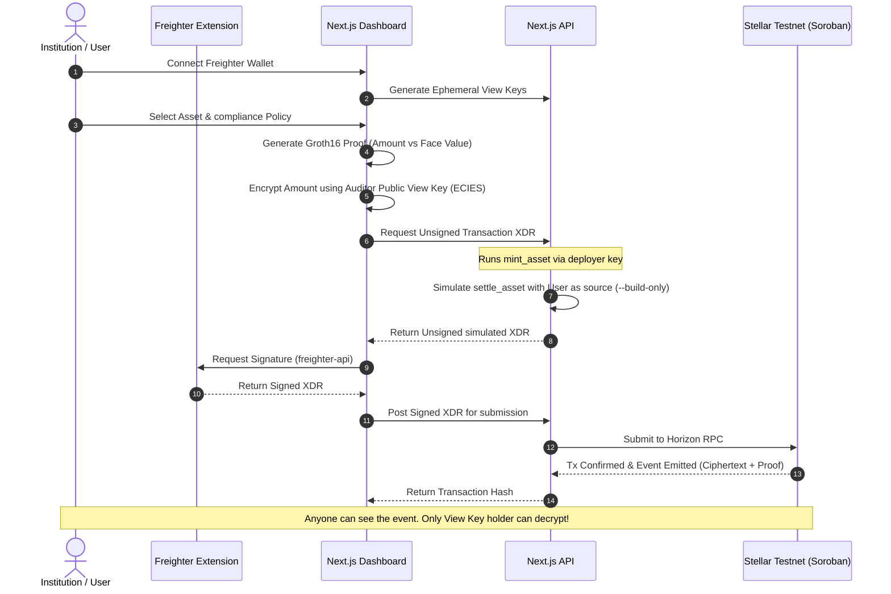

# Lantern: Institutional Private RWA Registry & Settlement on Stellar

Lantern implements a load-bearing, production-grade **Zero-Knowledge Proof (ZKP)** private settlement and **selective disclosure** mechanism for tokenized Real-World Assets (RWAs) on the Stellar Testnet. 

By leveraging native **BLS12-381** elliptic curve support in Soroban (Protocol 27+), Lantern verifies that private transaction values satisfy asset face-value policies without leaking private balances to the public ledger.

---

## 🏗️ Architecture Overview

The settlement pipeline integrates zero-knowledge cryptography, hybrid ECDH + AES-256-GCM encryption (ECIES), and decentralized client-side signing:



---

## 🔑 Key Capabilities

1.  **Zero-Knowledge Compliance Engine (`Circom + Groth16`):**
    *   Proves that the private transaction value matches the locked RWA face value.
    *   Verifies set-membership and inequality compliance constraints on-chain using native Soroban pairing operations.
2.  **ECIES On-Chain Event Storage:**
    *   Uses a hybrid **ECDH (secp256r1) + AES-256-GCM** scheme to encrypt private ledger metadata using the auditor's Public View Key.
    *   Emits the ciphertext directly on-chain as a Soroban ledger event, binding the audit trail permanently to the transaction.
3.  **Two-Phase Freighter Wallet Signing:**
    *   Bypasses custodial backend signing for settlements.
    *   The backend simulates the contract invocation dynamically using the `--build-only` flag, returning an unsigned simulated XDR.
    *   The user's Freighter extension signs the transaction on-client, and it is submitted directly to the Horizon Testnet.
4.  **Automatic Friendbot Funding:**
    *   To streamline testing, connecting a fresh Freighter wallet automatically triggers Friendbot to fund the address with testnet XLM.

---

## 📂 Project Structure

```text
├── circuits/                       # ZK Proof Infrastructure
│   ├── settlement.circom           # Proving logic (Amount verification & commitment check)
│   ├── poseidon255.circom          # Hash function constraint definition
│   ├── custom_vk_args.json         # Groth16 verification key parameters formatted for Soroban
│   └── custom_proof_args.json      # Groth16 proof parameter vectors formatted for Soroban
│
├── contracts/
│   └── rwa_settlement/             # Soroban Smart Contract source code
│       ├── src/lib.rs              # Contract logic (mint_asset, settle_asset, verification)
│       └── Cargo.toml
│
├── frontend/                       # Next.js App Router Frontend
│   ├── src/app/
│   │   ├── page.tsx                # High-fidelity Geniestudio Landing Page
│   │   └── app/page.tsx            # Compliance console and settlement dashboard
│   │   └── api/settle/route.ts     # Two-phase transaction simulation & Horizon submitter
│   └── package.json
│
├── src/utils/                      # Cryptographic utilities and scripts
│   ├── cryptoDisclosure.ts         # ECDH secp256r1 + AES-256-GCM browser/node implementation
│   ├── run_onchain_settlement.js   # Automated integration test runner
│   └── test_disclosure.js          # Disclosure encryption/decryption unit test
```

---

## 🌐 On-Chain Deployment Details (Stellar Testnet)

*   **Groth16 Verifier Contract ID:** `CCRUK3TL4BQMSOI5KHC4DO2VIJ7P7TTWFVXYRKPCVGMCLW2YIAO5JI6B`
*   **RWA Settlement Controller Contract ID:** `CACFHOCMFKHVUR4UKS5W5XG4QCQBDCDDDT54SOOMHYBHKZIQA43MREUT`
*   **Stellar Network:** Testnet (Protocol 27 active)

---

## 🚀 Local Development & Execution

### Prerequisites
*   Node.js (v18+)
*   Freighter Wallet Browser Extension (Configured for Stellar Testnet)
*   Stellar CLI (For executing local contract simulations)

### 1. Launch Next.js Dev Server
To bypass Turbopack watch-loop bottlenecks on WSL/Windows paths, launch the dev server with Webpack mode:
```bash
cd frontend
npm install
npx next dev --webpack
```
Open **[http://localhost:3000](http://localhost:3000)** in your browser.

### 2. Run Automated On-Chain Settlement Script
You can trigger a mock settlement simulation directly from your terminal:
```bash
# Fund your testing accounts and compile the witness
cd src/utils
node run_onchain_settlement.js
```
This script executes:
1.  Auditor view keypair generation.
2.  ECDH key exchange and AES-GCM encryption of the asset price.
3.   Soroban RPC call to mint the asset on-chain.
4.  Soroban RPC call to verify the ZK proof and emit the encrypted disclosure on-ledger.
5.  Retrieval of the event payload from the ledger and decryption verification using the private View Key.

---

## 🔒 Security Disclosures & Warning

> [!WARNING]
> **Powers of Tau Ceremony Note:**
> The structured setup (Powers of Tau) utilized for compiling this circuit's parameters was generated locally using a single-contributor ceremony (`npx snarkjs powersoftau new bls12381 10 ...`). 
> This is a local development setup intended solely for prototyping and verification testing. It does not constitute a secure multi-party trusted setup and must not be used for production deployments.
